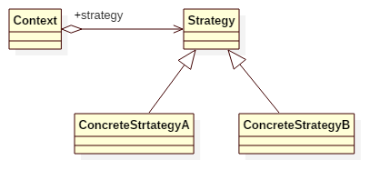

# Strategy Pattern

## Intent
Define a family of algorithms, encapsulate each one, and make them interchangeable.
Strategy lets the algorithm vary independently from clients that use it.

## Applicability
Use the Strategy pattern when
* many related classes differ only in their behavior. Strategies provide a way to configure a class with one of many behaviors.
* you need different variants of an algorithm.
* an algorithm uses data that clients shouldn't know about. Use the Strategy pattern to avoid exposing complex, algorithm-specific data structures.
* a class defines many behaviors, and these appear as multiple conditional
statements in its operations. Instead of many conditionals, move related
conditional branches into their ownStrategy class.

## Structure

